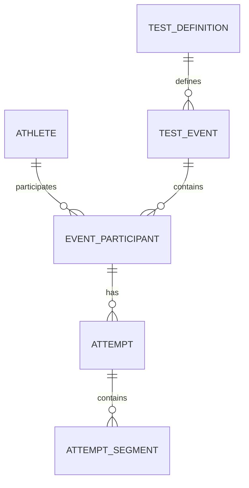

# Stage 1 · Design draft v0.1

Source: https://app.notion.com/p/3eb615d5439e817abacecc9a3fdfa153?pvs=204
Snapshot retrieved: 2026-09-30. Source last edited: 2026-09-30T17:27:54.369Z

# Статус
Начато 30.09.2026. Рабочий проект дизайна; предложения ниже не подменяют согласованные требования Discovery.
# Цель этапа
Подготовить модель и сценарии, на которых можно реализовать первый вертикальный срез: тренер создаёт тест → вводит результаты → публикует → спортсмен видит результат и рейтинг.
# Модель и grain
<table header-row="true">
<tr>
<td>Сущность</td>
<td>Одна запись</td>
<td>Основные поля и ограничения</td>
</tr>
<tr>
<td>Athlete</td>
<td>Один спортсмен клуба</td>
<td>id, club_id, имя, фамилия, sex nullable, birth_date nullable, sport_status. Исторический спортсмен может не иметь аккаунта.</td>
</tr>
<tr>
<td>ClubUser</td>
<td>Членство аккаунта в клубе</td>
<td>club_id, user_id, role, access_status; уникальная пара club/user. Связь с athlete необязательна; тренер может также быть спортсменом.</td>
</tr>
<tr>
<td>GroupMembership</td>
<td>Период членства спортсмена в группе</td>
<td>athlete_id, group_id, start_date, end_date nullable; конец не раньше начала.</td>
</tr>
<tr>
<td>TestDefinition</td>
<td>Вид сопоставимого теста</td>
<td>discipline, distance_m, stroke_code nullable, format_code; дистанция положительна. Например 400 м кроль.</td>
</tr>
<tr>
<td>TestEvent</td>
<td>Один тест в определённую дату и условиях</td>
<td>club_id, definition_id, occurred_at/date, venue, environment, draft/published, created_by. Длина бассейна исключена из MVP.</td>
</tr>
<tr>
<td>EventParticipant</td>
<td>Один спортсмен в тесте</td>
<td>event_id, athlete_id; уникальная пара. Приглашение в аккаунт не требуется для ввода результата.</td>
</tr>
<tr>
<td>Attempt</td>
<td>Одна попытка участника</td>
<td>participant_id, attempt_no, time_cs nullable, status, comment, entered_by, revision. Уникальный номер в рамках участника.</td>
</tr>
<tr>
<td>AttemptSegment</td>
<td>Один этап попытки триатлона</td>
<td>attempt_id, segment_code, time_cs; уникальная пара attempt/segment.</td>
</tr>
<tr>
<td>ImportRecord</td>
<td>Исходная строка импорта</td>
<td>batch_id, sheet, row, raw_payload, processing_status, target_attempt_id nullable; исходная строка не теряется.</td>
</tr>
</table>
Роли и статусы пока рабочие обозначения. Все ссылки должны проверять принадлежность одному клубу, а не только существование ID.
# ERD — спортивное ядро

# Условия сопоставимости
Для бассейнового плавания категория сравнения: дисциплина + фактическая дистанция + стиль/формат. По решению пользователя длина бассейна не учитывается в MVP: результаты 25 м и 50 м объединяются в PB, прогрессе и рейтингах. Учёт открытой воды остаётся отдельным вопросом.
Для триатлона формат/дистанции этапов должны быть частью категории; одинаковое название Sprint не гарантирует одинаковые условия.
# Производные показатели
Официальный результат вычисляется из попыток; отдельную копию времени в Athlete не хранить.
1. Отфильтровать опубликованные тесты и валидные завершённые попытки.
2. Выбрать минимум time_cs на event/athlete. При равенстве выбрать меньший attempt_no для отображения.
3. PB: минимум среди официальных результатов сопоставимой категории.
4. All-Time: одна запись спортсмена на категорию, затем рейтинг по времени.
Предложение для ничьих: competition rank 1/1/3. Порядок строк при ничьей может быть по имени, но место одинаковое.
Latest и предыдущий результат определять по дате старта, не по времени ввода. Одинаковая дата без времени требует отдельного правила; не изображать доказанную хронологию.
Group history и age group: возраст/группа на дату события для исторического анализа; текущая группа — отдельный режим.
# Инварианты и исправления
- FINISHED требует time_cs больше нуля. DNS/DNF/DSQ имеют nullable time_cs и не участвуют в PB.
- Сотые секунды хранятся целым числом: 01:02.34 = 6234.
- Опубликование выполняется атомарно; повторный запрос не создаёт второй тест.
- Одновременное редактирование тренерами: revision предотвращает тихое перезаписывание чужой правки.
- Исправления опубликованного результата сохраняют аудит автора, времени и старого значения; PB и рейтинги пересчитываются.
- Не выводить total триатлона из неполных сплитов. Введённый total и сумма известных сегментов сверяются отдельно.
# Сценарий тренера
Создать тест → выбрать дисциплину, дистанцию, стиль, дату и условия → выбрать участников → внести время → добавить попытку при необходимости → проверить → опубликовать.
## Новый спортсмен на старте — FR-12
Подтверждено 30.09.2026: спортсмен может впервые появиться в БД при подготовке или начале старта.
Предложенный UI: поиск участника → «Добавить нового спортсмена» → имя и фамилия → «Создать и добавить в старт». Пол и дата рождения необязательны; неизвестный пол не попадает в рейтинг конкретного пола, а неизвестный возраст — в age group.
Создаётся Athlete и EventParticipant; аккаунт и приглашение создаются отдельно позже. Не назначать автоматически абонемент или статус оплаты.
Перед созданием показывать похожие существующие имена, но совпадение ФИО не запрещать: у разных людей могут быть одинаковые имена. Выбор существующего спортсмена использует его ID.
Операция создания и включения в старт атомарна; повтор отправки одного запроса не создаёт дубль. Введённые ранее результаты и выбранные участники сохраняются при открытии формы.
Критерий приёмки: тренер добавляет отсутствующего спортсмена, вводит ему попытку и публикует результат без выхода из сценария старта и без аккаунта спортсмена.
Сохранение черновика не открывает результаты спортсменам. Перед публикацией показать пропущенные результаты; разрешение частичной публикации ещё уточняется.
# Сценарий спортсмена
Главная: последний результат, PB, изменение, переход к категории.
Категория: график, диапазон дат, касание точки → дата/время; история карточками.
Рейтинг: This Test / All-Time; дистанция, стиль, пол; активный фильтр всегда видим.
Для спортсмена без результатов — понятный пустой экран, без выдуманных KPI.
# Контракты первого вертикального среза
- CreateTest: definition, дата, условия, участники → draft event.
- CreateAthleteAndAddParticipant: event, имя/фамилия, необязательные данные, ключ повторного запроса → athlete и participant либо ошибки проверки. Сервер проверяет права тренера и принадлежность клубу.
- SaveAttempt: participant, attempt_no, time/status, ожидаемая revision → сохранённая попытка либо конфликт.
- PublishTest: event, ожидаемая revision → опубликованный тест либо ошибки проверки.
- ReadResults: event/category и фильтры → официальный результат, PB, rank с указанным контекстом.
Это логические контракты, а не выдуманные SDK/API платформы.
# Приёмка этапа и задачи
- [x] Подготовлен draft модели, grain и инвариантов.
- [x] Описаны первый вертикальный срез и сценарии.
- [ ] Проверить исходный Excel и mapping; аудит пока не выполнен.
- [ ] Подтвердить условия сравнения и права публикации.
- [ ] Создать mobile wireframes с реальными полями и пустыми/ошибочными состояниями.
- [ ] Зафиксировать стек и подготовить исполняемую migration schema.
- [ ] Реализовать и проверить вертикальный срез.
# Решение по длине бассейна · 30.09.2026
Основной бассейн клуба — 50 м, иногда 25 м. Пользователь отклонил учёт длины бассейна в MVP. Поле, переключатель и отдельные категории 25/50 м не включаем; PB, прогресс и рейтинги общие. Предыдущее предложение о раздельных рейтингах заменено этим решением. Открытая вода этим решением не определена.

